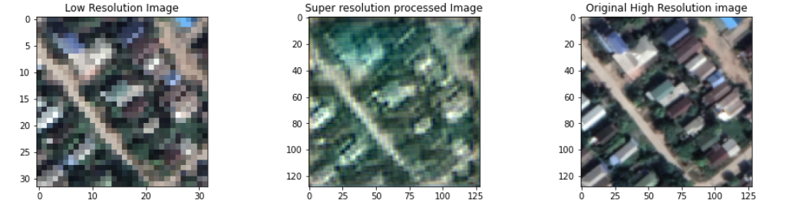

# SRGAN_Satellite_image_super_resolution
This is an attempt to perform SuperResolution on RGB satellite image.
Ref : https://github.com/bnsreenu/python_for_microscopists/tree/master/255_256_SRGAN

## Project Structure
The descriptions of principal files in this project are introduced as follows:
* data/original_images : include augmented RGB images from random area of interest to downscale and upscale images 

* Super_Resolution_Satellite_Image_SRGAN.ipynb : notebook for performing super resolution on satellite images
  
## Principal Environmental Dependencies
* PIL
* numpy
* pandas
* tensorflow
* matplotlib

## Predicted Results 
 
